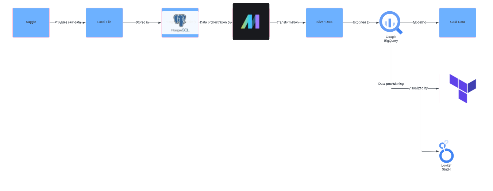
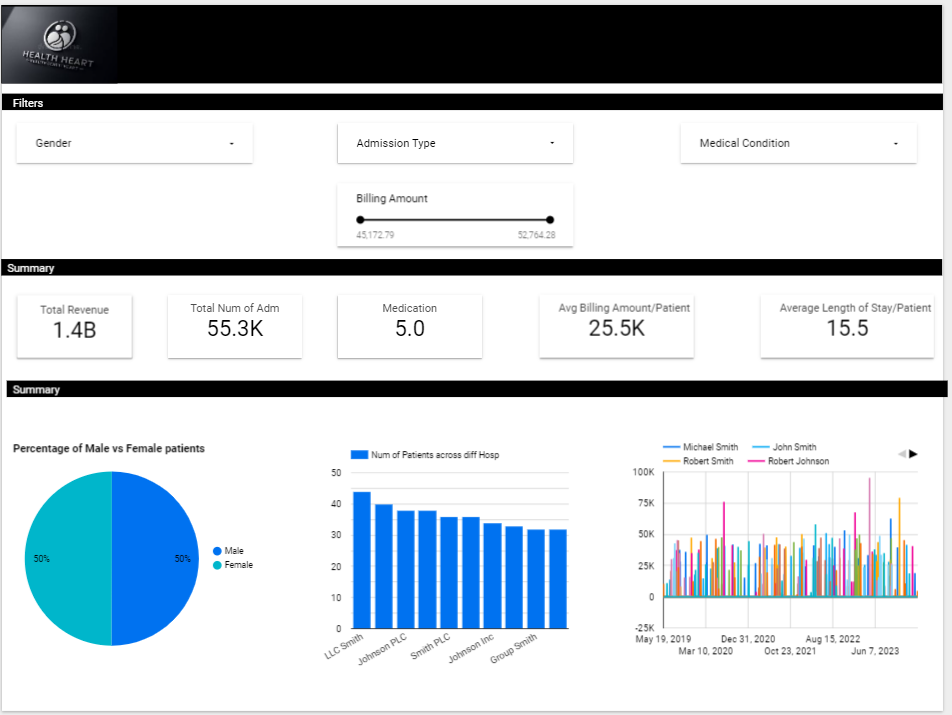

# Healthcare Data Project

## Overview

This project involves building a data pipeline for healthcare data using various tools and technologies. The pipeline processes data from Kaggle, performs ETL operations, and visualizes results in Looker Studio. Key components include PostgreSQL for storage, Mage AI for orchestration, BigQuery for data modeling, and Looker Studio for visualization.

## Project Structure

- **`healthcare-data-project/`**: Root directory containing the entire project.
- **`mage_healthcare_project/`**: Contains ETL scripts and Mage AI configuration.
- **`data_loaders/`**: Scripts for loading data.
- **`data_exporters/`**: Scripts for exporting data.
- **`transformers/`**: Scripts for data transformations.
- **`pipelines/`**: Defines ETL pipelines.
- **`utils/`**: Utility functions and helper scripts.
- **`mage_healthcare_project_backup/`**: Backup directory with additional Mage project configurations.
- **`Dockerfile`**: Dockerfile for building the Mage AI Docker image.
- **`docker-compose.yml`**: Docker Compose configuration for orchestrating containers.
- **`requirements.txt`**: Python package dependencies.
- **`metadata.yaml`**: Metadata configuration file.

## Setup Instructions

1. **Clone the Repository**

   ```sh
   git clone https://github.com/Qaladid/healthcare-data-project.git
   cd healthcare-data-project

2. **Configure Environment Variables**

Create a `.env` file in the root directory with the following content:
 **`POSTGRES_DBNAME=your_dbname/`**
 **`POSTGRES_USER=your_username/`**
 **`POSTGRES_PASSWORD=your_password/`**
 **`POSTGRES_HOST=your_host/`**
 **`POSTGRES_PORT=your_port/`**

3. **Start Docker Containers**
  
  **`docker-compose up`**
 - This will start PostgreSQL and Mage AI containers.

5. **Run ETL Pipelines**

 - Access the Mage AI interface at http://localhost:6789 and trigger the ETL pipelines as needed.

6. **Verify Data in BigQuery**

 - Ensure the data is correctly loaded and transformed by checking your Google BigQuery instance.
 - You can check the ERD i provided in the images directory to get a high level understanding of how data are related through dimensions and fact tables.

7. **Access Looker Studio**

 - Go to Looker Studio to view your dashboards and reports.
 - Ensure your data sources are connected correctly.

**Tips for Navigating the Project**
 - ETL Scripts: Located in the mage_healthcare_project/ directory. Modify these scripts to update the data pipeline.
 - Docker Management: Use docker-compose commands to manage containers. For example, docker-compose down to stop containers and docker-compose up to     restart  -them.
 - BigQuery Data: Check tables and schemas directly in Google BigQuery for any data issues.
 - Looker Studio: Use Looker Studio to create and manage visualizations. Ensure data sources are correctly configured to reflect changes.

**Troubleshooting**
 - Container Issues: If containers fail to start, check logs using docker-compose logs and ensure no port conflicts.
 - Data Access Problems: Verify network configurations and permissions for accessing BigQuery and Looker Studio.
 - Project Setup Errors: Double-check environment variables and dependency installations.

## Project Workflow Diagram
 Below is the workflow diagram that illustrates the data pipeline:
 
 

## Dashboard
 Here is the final dashboard showing the visualizations:
 
 

